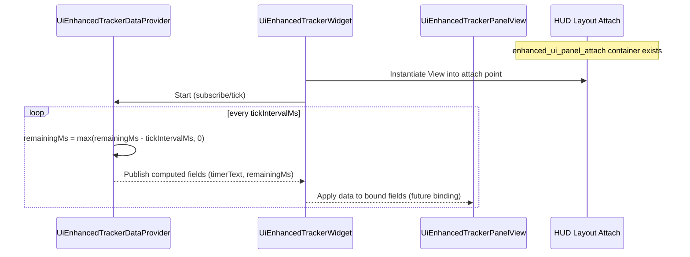

# Enhanced Tracker – Wiring Diagram and Provider Stub

This document shows how the Enhanced Tracker panel is wired into the HUD (following the official Status Effects pattern) and explains the basic provider stub used for a static countdown.

## High‑Level Wiring

Mermaid (conceptual component flow):

```mermaid
flowchart LR
  subgraph AssetStorage
    A[EnhancedTrackerPanel → UiEnhancedTrackerPanelView]
  end

  subgraph HUDLayout
    B[UiAttachmentsComponent]
    C[enhanced_ui_panel_attach (UiFusionContainer)]
  end

  subgraph Screen(PVE Screen)
    D[UiEnhancedTrackerWidget\nprovider: UiEnhancedTrackerDataProvider]
  end

  A -->|layer: HUD| D
  D -->|assetLink: Hud.EnhancedTrackerPanel| A
  B -->|UiEnhancedTrackerPanelView = "enhanced_ui_panel_attach"| C
  D -->|instantiated view attaches into| C
```

File references:
- Asset holder: `mods_source/ssl/ui/systems/asset_managing/ui_asset_storage.sso`
  - `EnhancedTrackerPanel` has `__type = "UiEnhancedTrackerPanelView"`.
- HUD layout mapping + attach point: `mods_source/enhanced_ui/ssl/ui/fusion/hud/hud_layout/ui_hud_pve_view.sso`
  - `UiEnhancedTrackerPanelView = "enhanced_ui_panel_attach"`
  - `childs.enhanced_ui_panel_attach = UiFusionContainer` (empty attach‑only container at the desired position).
- Widget spawn (PVE): `mods_source/ssl/ui/fusion/hud/hud_layout/code/pve/ui_pve_screen.sso`
  - `EnhancedTrackerPanel = { providerDesc { __type = UiEnhancedTrackerDataProvider }, __type = UiEnhancedTrackerWidget }`.
- Widget + View assets (mod):
  - `ui_enhanced_tracker_widget.sso` (`assetLink = "Hud.EnhancedTrackerPanel"`).
  - `ui_enhanced_tracker_panel_view.sso` (the visual tile: frame, icon, timer text, label).

## Runtime Data Flow



Note: The current view is static; future binding will map provider fields to the `timer_text` and `label` when we integrate a small binding step or reuse an engine class that reads provider output.

## Provider Stub

Config file: `mods_source/enhanced_ui/ssl/ui/fusion/hud/enhanced_tracker/code/ui_enhanced_tracker_data_provider.sso`

- Purpose: Provide a minimal, self‑contained countdown entry used by the widget.
- Shape (current):
  - `entry.id = "restock"`
  - `entry.label = "Restock"`
  - `entry.totalMs = 60000` and `startRemainingMs = 60000`
  - `tickIntervalMs = 1000`
  - `__type = "UiEnhancedTrackerDataProviderBase"`

Widget hookup (UI-only experiment): defined in `ui_pve_screen.sso` as
```
EnhancedTrackerPanel = {
  __type = "UiEnhancedTrackerWidget"
}
```

### How the Stub Should Work
- On widget init, the provider starts with `remainingMs = startRemainingMs`.
- Every `tickIntervalMs`, it decrements remaining (floor at 0) and computes a `timerText` (e.g., `"60.0" → "59.0" ...`).
- The widget applies `timerText` to the view’s `timer_text` field and keeps `label` fixed. When `remainingMs == 0`, the tile can enter a “ready” state (future animation or glow).

### Current Limitations and Next Bindings
- The current view uses generic elements (`UiFusionContainer`, `UiFusionTextfield`). Without a binding step, text won’t change yet.
- Next iteration will add a small data‑binding:
  - Option A: Add a binding bridge similar to `UiWatermarkDataProvider` pattern (view exposes `timerTextfield` path; provider writes text).
  - Option B: Replace `timer_text` with an existing engine timer UI class used elsewhere (if available) that reads provider values.

### Validation
- Build and run. No errors should appear; the panel spawns and shows the static tile.
- Logs (if available) should show the provider active. Visual change will come after the binding step.

## Why Attach-Only Failed

- Adding `UiEnhancedTrackerPanelView` / `UiEnhancedTrackerWidget` introduced brand-new `__type` names.
- Vanilla classes (e.g., `UiStatusEffectPanelView`) have corresponding compiled `.ssc` resources; our new types do not.
- When the HUD asset holder requested `__type = "UiEnhancedTrackerPanelView"`, the loader waited for a compiled class that never arrived, stalling resource loading.
- Trimming the `.resource` dependencies and removing `UiDataDrivenComponent` reduced noise, but the hang persisted because the core issue is the missing engine class.

### Conclusion
- Until we figure out how to create/ship compiled UI classes, stick with inline HUD definitions (no new `__type` names) or reuse existing engine views/widgets.
- Attach-only wiring with custom types requires matching `.ssc` resources; without them, missions stay on the loading screen.

## Current State (2025-10-12)

- Enhanced Tracker now follows the attach-only pattern again, but without any data provider logic:
  - `ui_hud_pve_view.sso` exposes `enhanced_ui_panel_attach` and maps `UiEnhancedTrackerPanelView` to it.
  - `ui_asset_storage.sso` registers `EnhancedTrackerPanel` (`__type = "UiEnhancedTrackerPanelView"`) on the HUD layer.
  - `ui_pve_screen.sso` instantiates `UiEnhancedTrackerWidget` with no `providerDesc`.
  - Widget (`ui_enhanced_tracker_widget.sso`) is a bare `UiHidableWidget` pointing at `Hud.EnhancedTrackerPanel`.

- View asset `ui_enhanced_tracker_panel_view.sso` (plus `.resource`) now contains only static visuals (container + bitmaps + textfield). No `UiDataDrivenComponent` is present while we stay UI-only.

- Latest `.pak` for this experiment must include:
  - `ssl/ui/fusion/hud/hud_layout/ui_hud_pve_view.sso`
  - `ssl/ui/systems/asset_managing/ui_asset_storage.sso`
  - `ssl/ui/fusion/hud/hud_layout/code/pve/ui_pve_screen.sso`
  - `ssl/ui/fusion/hud/enhanced_tracker/ui_enhanced_tracker_panel_view.sso`
  - `ssl/ui/fusion/hud/enhanced_tracker/ui_enhanced_tracker_panel_view.sso.resource`
  - `ssl/ui/fusion/hud/enhanced_tracker/ui_enhanced_tracker_widget.sso`
  - `ssl/ui/fusion/hud/enhanced_tracker/ui_enhanced_tracker_widget.sso.resource`

- Reference screenshot: `docs/screenshots/progress/2025-10-12_static_panel.png` (from the inline experiment; visuals unchanged).

- Next step: validate mission load with this attach-only wiring, then wire in a lightweight binding layer or stub provider.
